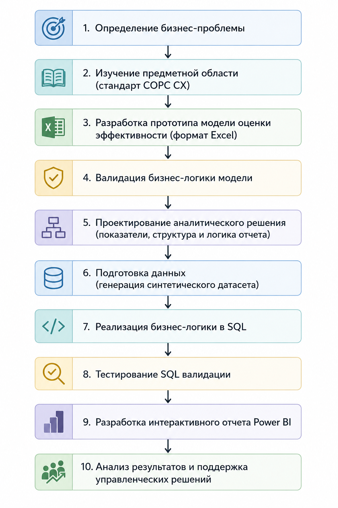
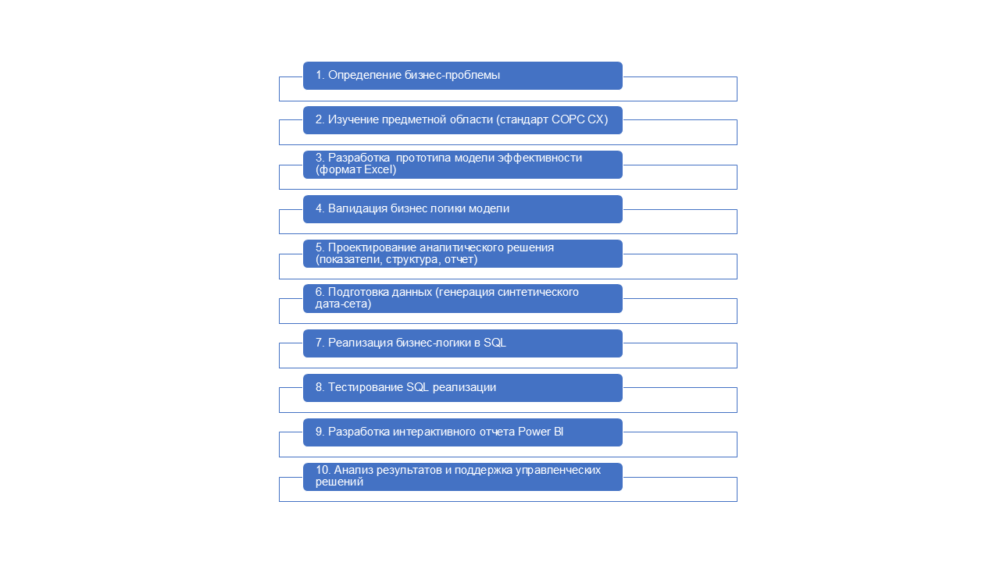
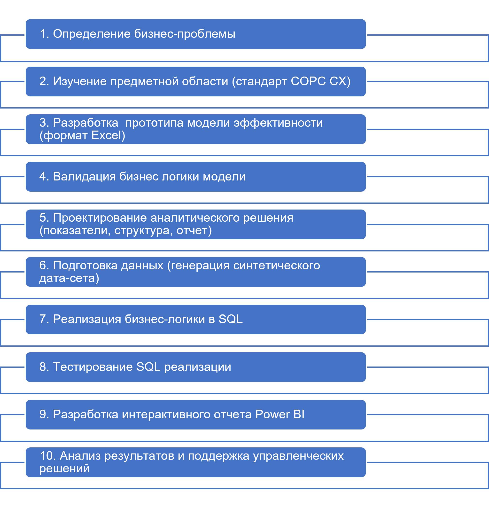

# Система оценки эффективности сотрудников клиентской поддержки

**Роли:** Data Analyst · BI Analyst · Business Analyst  
**Инструменты:** SQL · SQLite · Power BI

##### **## 📌 Обзор проекта**

Проект представляет собой аналитическую систему оценки эффективности сотрудников клиентской поддержки, разработанную для унификации и автоматизации оценки результатов и поддержки управленческих решений руководителей групп и подразделений.

Решение объединяет **SQL-логику расчета выполнения KPI, динамики показателей и итоговой классификации сотрудников с интерактивным отчетом Power BI**, позволяющим анализировать результаты на уровне подразделений, групп и отдельных сотрудников.

**Ключевая особенность проекта:**
Оценка эффективности строится на результатах **последних четырех отчетных месяцев**. Для каждого KPI учитываются как выполнение целевого значения, так и динамика показателя. На основе количества выполненных KPI и характера их динамики сотрудник классифицируется по одному **из трех типов эффективности, включающих девять сценариев оценки.**

**Основные возможности проекта:**
* Сравнение фактических результатов сотрудников с целевыми значениями KPI;
* Классификация сотрудников по уровню эффективности;
* Анализ динамики показателей за несколько месяцев;
* Формирование аналитической витрины средствами SQL;
* Визуализация результатов и интерактивный анализ в Power BI;
* Детальная аналитика результатов отдельных КЦ, групп и сотрудников.

\---

##### **## 🎯 Бизнес-проблема**

Руководителям поддержки необходимо регулярно оценивать эффективность сотрудников по нескольким KPI. При большом количестве сотрудников анализ результатов становится трудоемким: требуется сопоставлять факт с планом по нескольким показателям, отслеживать их динамику и определять сотрудников, которым необходимо внимание.

При этом **не существовало единой системы оценки эффективности и централизованного представления результатов.** Руководители самостоятельно анализировали показатели своих команд и могли использовать разные подходы к оценке. Это увеличивало трудозатраты на анализ и затрудняло формирование единой и прозрачной картины эффективности сотрудников.

Отдельные KPI не позволяли быстро оценить эффективность сотрудника в целом, **а отсутствие единой истории результатов и визуализации динамики затрудняло выявление долгосрочных тенденций.** 
Для руководителей более высокого уровня было сложно оперативно оценить, **что происходит внутри команд, где находятся зоны риска и наблюдается ли улучшение или снижение эффективности.**

В результате возникла потребность в единой системе оценки, которая объединяет несколько KPI в итоговую оценку эффективности, сохраняет историю результатов и предоставляет руководителям наглядную аналитику для принятия управленческих решений.

\---

##### **## 💡 Решение**

Для формирования подхода к оценке был изучен стандарт **COPC CX — «Требования к системе управления контактными центрами».** На его основе, с учетом специфики работы клиентской поддержки, была разработана и адаптирована модель оценки эффективности сотрудников, объединяющая выполнение нескольких KPI и динамику показателей в единую систему классификации.

Для автоматизации модели была реализована SQL-логика расчета **выполнения KPI, динамики показателей и итоговой классификации сотрудников**, а результаты представлены в интерактивном отчете Power BI.

\---

##### **## 🧠 Логика классификации**

Алгоритм оценки классификации состоит из трех последовательных этапов:
**1. Анализ выполнения KPI**
Для каждого сотрудника оценивается выполнение четырех ключевых показателей за последние четыре отчетных месяца. KPI считается выполненным, если целевой уровень достигнут не менее чем в трех из четырех месяцев, что позволяет учитывать устойчивость результата, а не единичное выполнение показателя.

**2. Анализ динамики показателей**
Для каждого KPI результаты третьего и четвертого месяцев сравниваются со средним значением первых двух месяцев анализируемого периода. Если оба последних месяца превышают это среднее значение, динамика считается положительной, если хотя бы один из них не превышает среднее значение, динамика считается отрицательной.

**3. Классификация сотрудников**
На основании количества выполненных KPI и результатов анализа динамики сотрудники распределяются по девяти сценариям эффективности, которые объединяются в три итоговые категории:

**🟢 Высокоэффективные**
**🟡 Среднеэффективные**
**🔴 Низкоэффективные**

\---

##### **## ⚙️Рабочий процесс проекта**

  </img>

\---

