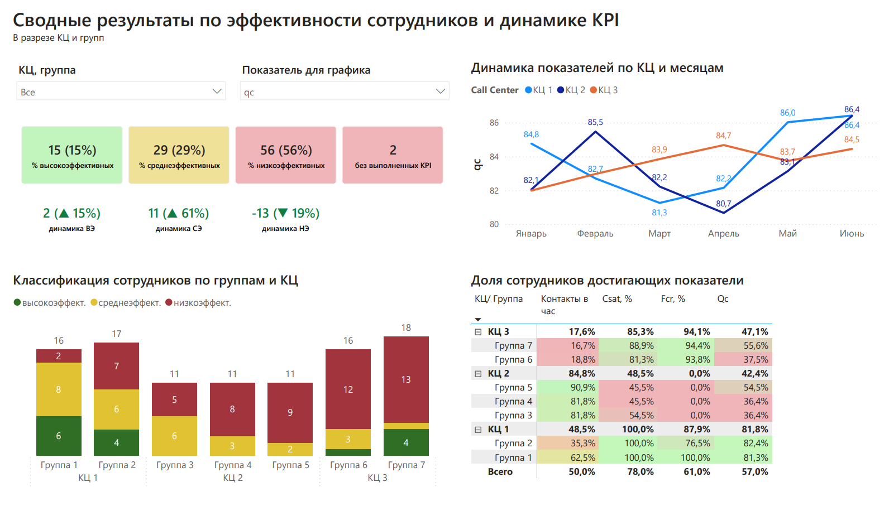
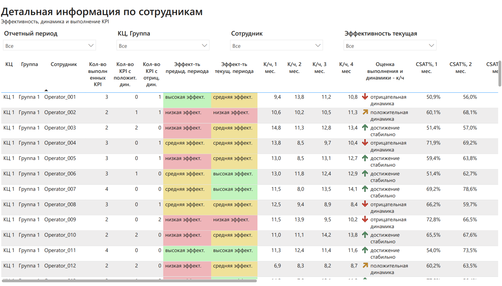

# Система оценки эффективности сотрудников клиентской поддержки

**Роли:** Data Analyst · BI Analyst · Business Analyst  
**Инструменты:** SQL · SQLite · Power BI

**📌 Обзор проекта**

Проект представляет собой аналитическую систему оценки эффективности сотрудников клиентской поддержки, разработанную для унификации и автоматизации оценки результатов и поддержки управленческих решений руководителей групп, руководителей отделов и руководителей направлений.

Решение объединяет **SQL-логику расчета выполнения KPI, динамики показателей и итоговой классификации сотрудников с интерактивным отчетом Power BI**, позволяющим анализировать результаты на уровне подразделений, групп и отдельных сотрудников.

**Ключевая особенность проекта:**
Оценка эффективности строится на результатах **последних четырех отчетных месяцев.** Для каждого KPI учитываются как выполнение целевого значения, так и динамика показателя. На основе количества выполненных KPI и характера их динамики сотрудник классифицируется **по одному из трех типов эффективности. Для определения итоговой категории используется набор из девяти основных правил классификации, объединяющих различные комбинации выполнения KPI и динамики показателей.**

**Результат для пользователя:** руководитель получает единую картину эффективности сотрудников и команд, может быстро выявлять зоны риска, отслеживать изменения показателей и переходить от сводного результата к детализации на уровне отдельного сотрудника.

**Основные возможности проекта:**
* Сравнение фактических результатов сотрудников с целевыми значениями KPI;
* Классификация сотрудников по уровню эффективности;
* Анализ динамики показателей за несколько месяцев;
* Формирование аналитической витрины средствами SQL;
* Визуализация результатов и интерактивный анализ в Power BI;
* Детальная аналитика результатов отдельных КЦ, групп и сотрудников.

\---


**🎯 Бизнес-проблема**

Руководителям поддержки необходимо регулярно оценивать эффективность сотрудников по нескольким KPI. При большом количестве сотрудников анализ результатов становится трудоемким: требуется сопоставлять факт с планом по нескольким показателям, отслеживать их динамику и определять сотрудников, которым необходимо внимание.

При этом **не существовало единой системы оценки эффективности и централизованного представления результатов.** Руководители самостоятельно анализировали показатели своих команд и могли использовать разные подходы к оценке. Это увеличивало трудозатраты на анализ и затрудняло формирование единой и прозрачной картины эффективности сотрудников.

Отдельные KPI не позволяли быстро оценить эффективность сотрудника в целом, **а отсутствие единой истории результатов и визуализации динамики затрудняло выявление долгосрочных тенденций.** 
Для руководителей более высокого уровня было сложно оперативно оценить, **что происходит внутри команд, где находятся зоны риска и наблюдается ли улучшение или снижение эффективности.**

В результате возникла потребность в единой системе оценки, которая объединяет несколько KPI в итоговую оценку эффективности, сохраняет историю результатов и предоставляет руководителям наглядную аналитику для принятия управленческих решений.

\---

**## 💡 Решение**

Для формирования подхода к оценке был изучен стандарт **COPC CX — «Требования к системе управления контактными центрами».** На его основе, с учетом специфики работы клиентской поддержки, была разработана и адаптирована модель оценки эффективности сотрудников, объединяющая выполнение нескольких KPI и динамику показателей в единую систему классификации.

Для автоматизации модели была реализована SQL-логика расчета **выполнения KPI, динамики показателей и итоговой классификации сотрудников**, а результаты представлены в интерактивном отчете Power BI.

\---

**## 🧠 Логика классификации**

Алгоритм оценки состоит из трех последовательных этапов:
**1. Анализ выполнения KPI**
Для каждого сотрудника оценивается выполнение четырех ключевых показателей за последние четыре отчетных месяца. KPI считается выполненным, если целевой уровень достигнут не менее чем в трех из четырех месяцев, что позволяет учитывать устойчивость результата, а не единичное выполнение показателя.

**2. Анализ динамики показателей**
Для каждого KPI результаты третьего и четвертого месяцев сравниваются со средним значением первых двух месяцев анализируемого периода. Если оба последних месяца превышают это среднее значение, динамика считается положительной, если хотя бы один из них не превышает среднее значение, динамика считается отрицательной.

**3. Классификация сотрудников**
На основании количества выполненных KPI и характера их динамики сотрудники распределяются по трем итоговым категориям эффективности. Для определения категории используется 9 основных сценариев классификации, объединяющих различные сочетания выполнения KPI и динамики показателей.

**🟢 Высокоэффективные**
**🟡 Среднеэффективные**
**🔴 Низкоэффективные**

**📐 Матрица классификации эффективности**
<table style="width: 100%; max-width: 1200px; margin: 20px auto; border-collapse: collapse; table-layout: fixed; font-family: Arial, sans-serif; font-size: 14px;">
  <thead>
    <tr>
    </tr>
    <tr>
      <th>Категория</th>
      <th>0 из 4 выполняется</th>
      <th>1 из 4 выполняется</th>
      <th>2 из 4 выполняется</th>
      <th>3 из 4 выполняется</th>
      <th>4 из 4 выполняется</th>
    </tr>
  </thead>
  <tbody>
    <tr>
      <td style="padding: 12px 8px; vertical-align: middle; word-wrap: break-word; font-weight: bold;">
        <strong>Успешный</strong><br><br>Требуется поддержание текущих показателей и развитие новых навыков
      </td>
      <td align=center>—</td>
      <td align=center>—</td>
      <td align=center>—</td>
      <td>Если три показателя выполняются и есть динамика в показателе, который не достигается.</td>
      <td>Выполняются все показатели.</td>
    </tr>
    <tr>
      <td style="padding: 12px 8px; vertical-align: middle; word-wrap: break-word; font-weight: bold;">
        <strong>Наблюдается улучшение</strong><br><br>Требуется развитие
      </td>
      <td>Выполняется 0 показателей, а также в 2 и более показателях есть положительная динамика.</td>
      <td>Выполняется 1 показатель, а также в 2 и более показателях есть положительная динамика.</td>
      <td>Выполняется 2 показателя и в 2 показателях есть положительная динамика.</td>
      <td>Выполняется 3 показателя и в 1 показателе нет динамики.</td>
      <td align=center>—</td>
    </tr>
    <tr>
      <td>
        <strong>Требуется углубленное развитие</strong>
      </td>
      <td>Выполняется 0 показателей, положительная динамика есть либо только в 1 показателе, либо нет динамики ни в одном показателе.</td>
      <td>Выполняется 1 показатель и есть положительная динамика либо только в 1 показателе, либо нет динамики ни в одном показателе.</td>
      <td>Выполняется 2 показателя и есть положительная динамика только в 1 показателе, либо нет динамики ни в одном показателе.</td>
      <td align=center>—</td>
      <td align=center>—</td>
    </tr>
  </tbody>
</table>

**Легенда:**
* **KPI считается выполненным,** если целевой уровень достигнут не менее чем в 3 из 4 месяцев;
* 🟢 **Положительная динамика** — оба последних месяца выше среднего значения первых двух месяцев;
* 🔴 **Отрицательная динамика** — хотя бы один из последних двух месяцев не выше среднего значения первых двух месяцев.

\---

## **## ⚙️Рабочий процесс проекта**

Работа над проектом включала полный цикл — от определения бизнес-проблемы и валидации модели оценки эффективности до реализации аналитического решения и его использования руководителями в работе с результатами сотрудников.

<p align="center">
  </img>
</p>

\---

**## 🗄 Модель данных**

Для демонстрации проекта была разработана синтетическая модель данных, **имитирующая работу клиентской поддержки за 6 месяцев**. 
Модель включает фактические результаты сотрудников и нормативные значения KPI для разных КЦ, что позволяет рассчитывать эффективность сотрудников с учетом различных целевых показателей для нескольких подразделений.

**Структура модели:**
|**Таблица**|**Количество записей**|**Назначение**|
|-|-|-|
|[Results](./data/Results.csv)|600|Содержит фактические результаты сотрудников по четырем KPI за каждый отчетный месяц. <br />Одна запись соответствует одному сотруднику за один отчетный период.|
|[Targets](./data/Targets.csv)|72|Содержит целевые значения KPI для каждого КЦ и отчетного периода. <br />Для каждого сочетания «контактный центр + период» хранится отдельная запись по каждому KPI.|

**Основные характеристики данных:**
* **Тип данных:** синтетический 
* **Количество таблиц**: 2 
* **КЦ:** 3 
* **Групп операторов:** 7 
* **Сотрудников:** 100 
* **Период наблюдения:** 6 месяцев
* **KPI:** 4

**Проектные решения:**
* Нормативы KPI вынесены в отдельную таблицу и зависят от контактного центра;
* Результаты сотрудников хранятся отдельно от целевых значений;
* Модель поддерживает единый алгоритм расчета эффективности для КЦ с различными значениями KPI;
* Расчет эффективности выполняется по скользящему четырехмесячному окну, благодаря чему при добавлении нового отчетного периода классификация автоматически пересчитывается без изменения SQL-кода.

**Связь данных:**
Таблицы Results и Targets изначально имеют разную структуру хранения KPI. В Results четыре KPI представлены отдельными столбцами, тогда как в Targets каждый KPI хранится отдельной строкой.
Для сопоставления плановых и фактических значений в SQL таблица Targets преобразуется из длинного формата в широкий: для каждого сочетания «контактный центр + отчетный период» формируются отдельные поля с целевыми значениями четырех KPI. После преобразования структура таблиц становится сопоставимой, а плановые и фактические значения **объединяются по контактному центру и отчетному периоду.**

\---

**## 📝 SQL реализация**

Для автоматизации оценки эффективности сотрудников был разработан единый [SQL-скрипт](./sql/employee_performance.sql), реализующий полный цикл подготовки данных для последующей визуализации в Power BI.<br />

**Используемые конструкции SQL:** CTE · JOIN · CASE · Window Functions · Aggregations · WHERE / HAVING

Алгоритм построен с использованием Common Table Expressions (CTE), где каждый этап последовательно выполняет отдельную часть бизнес-логики и формирует данные для следующего шага обработки.

**Структура SQL-скрипта по CTE:**
1. **results\_with\_date** - преобразование текстовых отчетных периодов в формат даты для дальнейшей обработки;
2. **ordered\_results** - нумерация записей каждого сотрудника по хронологии с использованием ROW_NUMBER();
3. **report\_dates** - формирование отчетных периодов, начиная с четвертого месяца наблюдения, для которых доступно полное четырехмесячное окно анализа;
4. **ranked\_months** - ранжирование месяцев внутри каждого отчетного периода для формирования четырехмесячного окна анализа;
5. **targets\_pivot** - подготовка нормативов KPI в удобном для сравнения формате;
6. **aggregated** - расчет выполнения KPI, средних значений и четырехмесячной истории показателей для каждого сотрудника и отчетного периода;
7. **dynamics** - определение динамики по каждому KPI за анализируемый период;
8. **final\_calc** - расчет количества выполненных KPI и количества показателей с положительной и отрицательной динамикой;
9. **Final Select** - формирование итоговой аналитической витрины для Power BI с применением правил классификации.
    
**Результат:**
На выходе SQL формируется готовая аналитическая витрина, где каждая строка соответствует одному сотруднику в одном отчетном периоде.

**Витрина содержит:**
* Идентификационные данные (отчетный период, контактный центр, группа, сотрудник);
* Количество выполненных KPI;
* Количество KPI с положительной и отрицательной динамикой;
* Итоговый тип эффективности сотрудника;
* Историю значений каждого KPI за последние четыре месяца;
* Рассчитанную динамику по каждому KPI.

Таким образом, основная бизнес-логика расчета эффективности реализована в SQL, а Power BI используется для визуализации и интерактивного анализа подготовленной аналитической витрины.

▶️ **### Как запустить SQL**

**Среда выполнения:** SQLite

SQL-скрипт может быть воспроизведен на предоставленных в репозитории синтетических данных:
1. Загрузить [Results](./data/Results.csv) и [Targets](./data/Targets.csv) в SQLite;
2. Выполнить [SQL-скрипт](./sql/employee_performance.sql).

**Примечание:** в приложенном SQL-скрипте столбец с названием Group представлен как col2 в соответствии со структурой импортированной таблицы Results. При использовании другого способа импорта необходимо проверить соответствие названий столбцов SQL-скрипту.

\---

## **## 📊 Обзор отчета Power BI**

Интерактивный [отчет Power BI](./power_bi/employee_performance_report.pbix) разработан для комплексного анализа эффективности сотрудников клиентской поддержки. Отчет построен по принципу «от общего к частному»: [первая страница](./images/1_report_overview.png) предназначена для мониторинга общей эффективности и выявления проблемных групп, [вторая](./images/2_report_details.png) — для детального анализа результатов отдельных сотрудников.

**### 📋 Сводные результаты:**
Страница предназначена для оценки общей эффективности сотрудников, выявления проблемных групп и определения направлений для дальнейшего анализа.

**Важно:** сводные показатели первой страницы, отражающие количество и долю сотрудников по типам эффективности, а также долю достижения KPI, привязаны к последнему актуальному отчетному периоду. При этом итоговая классификация сотрудника определяется на основе результатов за последние четыре отчетных месяца.

Позволяет:
* Использовать интерактивную фильтрацию для анализа выбранного КЦ, группы или KPI;
* Анализировать количество и долю сотрудников по типам эффективности в своде и в разрезе групп/КЦ;
* Определять количество сотрудников и их структурное местоположение, у которых нет выполнения ни одного из показателей за 4 месячный период;
* Выявлять группы/КЦ с высоким количеством низкоэффективных сотрудников;
* Оценивать долю выполнения KPI и динамику показателей в разрезе по группе и КЦ.



**### 👤 Детализация по сотрудникам:**
Страница предназначена для детального анализа результатов сотрудника и факторов, повлиявших на его итоговую категорию эффективности.

Позволяет:
* Использовать фильтрацию для поиска и анализа результатов в разрезе: отчетного периода, КЦ/группы, сотрудника, типа эффективности последнего отчетного периода;
* Оценивать количество выполненных KPI и KPI с положительной/отрицательной динамикой в разрезе конкретного сотрудника;
* Сравнивать текущую и предыдущую категорию эффективности сотрудника;
* Просматривать историю каждого KPI за последние четыре месяца;
* Анализировать динамику каждого показателя.



\---

**## 📈 Результат проекта**

В результате была создана единая система оценки эффективности сотрудников, которая перевела анализ результатов из ручного и разрозненного процесса в автоматизированный и прозрачный формат.

**Масштаб применения:** решение использовалось на уровне **2 руководителей направлений, 7 руководителей отделов и 60 руководителей групп,** а расчет эффективности охватывал **800–1000+ сотрудников** в зависимости от сезонной численности.

**Что изменилось:**
* **Унифицирован подход к оценке эффективности:** несколько KPI, их выполнение и динамика объединены в единую модель классификации сотрудников с фиксированными правилами оценки.
* **Сократились трудозатраты на подготовку и анализ:** автоматизация расчета показателей и формирования сводных результатов сократила объем ручной работы на всех уровнях управления. **Для руководителя направления фактическая экономия времени оценивалась примерно в 6–8 часов в месяц.**
* **Результаты стали доступны в реальном времени:** руководители получили возможность самостоятельно отслеживать текущую эффективность сотрудников и команд через интерактивный отчет без дополнительной ручной подготовки сводок.
* **Повысилась прозрачность результатов:** единая аналитика стала доступна руководителям разных уровней, включая руководство более высокого уровня, которое ранее не имело оперативного доступа к сводной информации об эффективности команд.
* **Упростилась работа с зонами риска:** отчет позволяет быстро выявлять низкоэффективных сотрудников и группы с проблемной динамикой и использовать результаты для дальнейшей работы с ними.
* **Стала доступна единая история результатов:** отчет позволяет отслеживать показатели сотрудников за несколько месяцев и анализировать динамику, что упрощает выявление устойчивых изменений в эффективности.
* **Сформирована единая аналитическая основа для дальнейшего анализа:** SQL-витрина объединяет фактические результаты, нормативы KPI, историю показателей и результаты классификации и используется как единый источник данных для Power BI.
* **Автоматизировано обновление результатов:** SQL-логика и структура Power BI спроектированы таким образом, что после добавления данных за новый отчетный период показатели, четырехмесячное окно и классификация сотрудников автоматически пересчитываются. Для обработки нового периода не требуется изменять SQL-код или вручную перестраивать визуализации отчета.
* **Поддержаны управленческие решения:** результаты отчета использовались руководителями для определения сотрудников, требующих дополнительного внимания, анализа проблемных групп и оценки изменений эффективности команд.

\---

**## 📁 Структура репозитория:**

```text
employee-performance-report/
│
├── data/
│   ├── Results.csv
│   └── Targets.csv
│
├── images/
│   ├── 1_report_overview.png
│   ├── 2_report_details.png
│   └── 3_development_process.png
│
├── power_bi/
│   └── employee_performance_report.pbix
│
├── sql/
│   └── employee_performance.sql
│
├── LICENSE
└── README.md
